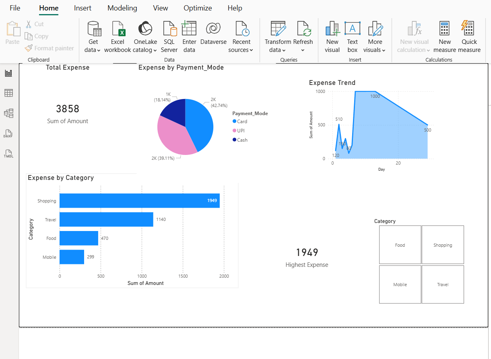

# Personal Expense Dashboard (Power BI)

## 📌 Project Overview
This is a beginner-level Power BI project created using Excel data.
The dashboard analyzes personal expenses and provides insights using visuals.

##Features
- Total Expense (Card)
- Expense by Category (Bar Chart)
- Expense by Payment Mode (Pie Chart)
- Expense Trend Over Time (Line Chart)
- Interactive Slicers

##Tools Used
- Power BI Desktop
- Microsoft Excel
- DAX (MAXX, SUM)

##Dashboard Preview

##Files
- Personal_Expense_Dashboard.pbix – Power BI report file
- expense_dashboard1.png – Dashboard screenshot
- expense_dashboard2.png
- expense_dashboard3.png

##Learning Outcome
- Understood Power BI visuals
- Learned axis selection
- Created basic DAX measures
- Built an interactive dashboard
